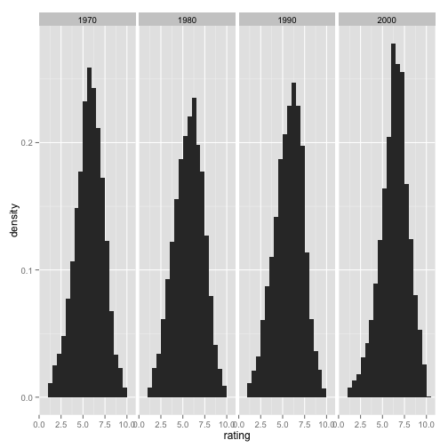

## Introduction

* Version Control with RStudio
 * Setting up a new repository/project
 * Setting up with an existing repository
* Working with RStudio to manage projects

--- .class #id 

## Version Control with RStudio
* RStudio has built in capabilities for SVN and Git
* Instead of coding in RStudio, and going to Git to commit, you can do it all in one place
* Easy facilities to bring in existing repositories (this is nice if you are already using Git)

---

## Process Flow

* Install your VCS of choice (well, Git or SVN)
* Fire up RStudio
** Start a new project using an existing directory under version control or...
** Start a new project using an existing repository as the basis
** Pull down an existing repository from, say, [GitHub](https://github.com/square/crossfilter) (not sure how different this is from forking...maybe this is forking? I actually think it's cloning....)
* n.b you can't _see_ git from RStudio unless you have a project...

---

## New Project
1. Project/Create New
2. Save or Don't save
3. Name your project & select its location
4. You can choose to create a git repository for this new project
5. Voila - you are working in a new project (if you have Git installed, you can use Git right away)

--- 

## Quick Demo
* Start a project (have to have R installed, and Git installed)
* Write some code
  * Commit it (you may get a Commit error the first time) 
  * If so, you may need [gitbash](https://help.github.com/articles/set-up-git#platform-windows)
* Change the code
* Commit it again

--- 

## Project from Existing Directory
* Make a project from an existing directory
* Easy Peasy, just browse to the directory

---

## What Happens When You Work With A Project?
* From [RStudio Help](http://www.rstudio.com/ide/docs/using/projects):
  * A new R session (process) is started
  * The .Rprofile file in the project's main directory (if any) is sourced by R
  * The .RData file in the project's main directory is loaded (if project options indicate that it should be loaded).
  * The .Rhistory file in the project's main directory is loaded into the RStudio History pane (and used for Console Up/Down arrow command history).
  * The current working directory is set to the project directory.
  * Previously edited source documents are restored into editor tabs
  * Other RStudio settings (e.g. active tabs, splitter positions, etc.) are restored to where they were the last time the project was closed.

---
## What Happens When You Quit?
* .RData and/or .Rhistory are written to the project directory (if current options indicate they should be)
* The list of open source documents is saved (so it can be restored next time the project is opened)
* Other RStudio settings (as described above) are saved.
* The R session is terminated.

--- 
## How Did I Make this Slide Deck?
> * [slidify](http://slidify.org/index.html)
> * Nicely integrated with R Studio
> * Uses R Markdown
> * Lets you do cool stuff like:

---
## Write some cool math
\[  \prod_{j\ge0}\left( \sum_{k\ge0} a_{jk}z^k \right) = \sum_{n\ge0} z^n \left(\sum_{k_0, k_1\ldots\ge0 \atop k_0+k_1+\cdots=0} a_{0k_0} a_{1k_1}\ldots \right) \]

--- 
## Display some R Code
```
library(ggplot2)
library(plyr)
movies$decade <- round_any(movies$year, 10, floor)
qplot(rating, ..density.., data = subset(movies, decade > 1960), 
geom = 'histogram', binwidth = 0.5) + 
facet_wrap(~ decade, ncol = 6)

```

---
## Source said R Code
 

